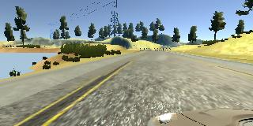
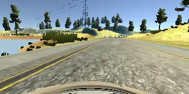
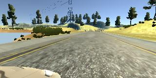
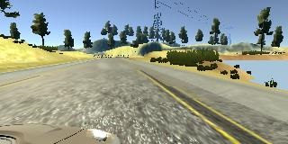
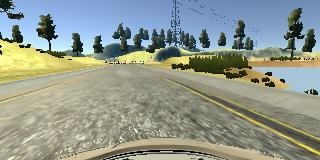
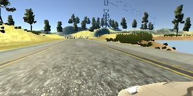

# Behaviorial Cloning Project

# Estimating a good correction parameter

The car is equipped with three cameras (left, center, and right). To use the images taken from the left and right camera for learning we have to adjust the measured steering angle. This is done by a fixed correction term. To find a good value for this correction term we did the experiment described in **correction_term.ipynb**. The experiments suggests to choose a correction term of 0.02.

# Procedure to find a successful  model

We tested many combinations of model architecture and data sets. We started with the model proposed by NVIDIA (https://devblogs.nvidia.com/parallelforall/deep-learning-self-driving-cars/). We adjusted the model by replacing 5x5 convolutions with 2 stacked 3x3 convolutions since this is more parameter efficient and introdcues more nonlinearity into the model. However, it turned out that the model is too powerfull and overfits the collected training data very fast. Adding dropout layer between the fully connected layer helps to overcome the overfitting. Nevertheless, training is still really slow and smaller models provide better performance on the validation set in considerable less time.

## The final model architecture

The following architecture is used for the final model:

### Preprocessing:
* Remove the top 50 and bottom 20 rows of the image
* Divide the image by 255 and substract 0.5

### Layers:
* Average Pooling Layer with size (2,2)
* Conv Layer with size (3,3) and depth 5 with an RELU activation
* Conv Layer with size (3,3) and depth 5 with an RELU activation
* Max Pooling Layer with size (2,2)
* Conv Layer with size (3,3) and depth 5 with an RELU activation
* Conv Layer with size (3,3) and depth 5 with an RELU activation
* Max Pooling Layer with size (2,2)
* A fully connected layer with 50 neurons and RELU activation
* A fully connected layer with 25 neurons and RELU activation
* A fully connected layer with 10 neurons and RELU activation
* A single output neuron

### Lossfunction:
* Mean squared error

The model contains 76320 weights and 106 biases. We used valid padding in each layer. We didn't use l2-regularization or dropout to prevent overfitting. Instead we choose a rather small model and saved the model after each training epoch. This allowed to use early stopping if the model started to overfit.

## Training the model

The parameters of the network were optimized using the adam optimizer. We started with a smaller data set (containing four laps of Track 1 (2 laps in each direction) and one lap of Track 2). The resulting model(after training for 20 epochs) could drive on most parts of the track but failed at difficult positions. We added some more data driving these difficult sections as well as some recovery trips. Using the new data, the model had improved but still showed some flaws at certain parts of the track (it could complete a round but not perfectly). We decided to drive 6 additional laps on Track 1 (3 for each direction) to enrich the  training data. We used the weights of the previous model as initialization and trained on the complete data set. The performance of the model had improved but at one point of the track it was still unsatisfactory. We created a really small data set driving only this specific part and presented the model with this small set (using a very small learning rate). After a few iterations the model learned to drive the last part correctly and kept its performance on the rest of the track. 

**Remark:** The model is also capable of driving on Track 2 (see video2.mp4).

The complete data set consisted of ~200000 training examples and ~50000 validation examples. Beside the images from the cameras we also used the flipped verions and changed the sign of the corresponding steering angle. The image flipping is carried out by the data generator process which is performed on the CPU, before the data is passed to the GPU for training.

Left camera             |  Center camera | Right camera
:-------------------------:|:-------------------------:|:-------------------------:
 | | 
 | | 

# Discussion

The model is capable of driving on Track 1 and Track 2. However, there are several drawbacks. First, it doesn't genaralize very well, e.g. using  different graphic settings for the simulator or forcing it off road using manual input shows its limitations. Overall, the training process was to specific with the goal to force one specific behaviour (complete Track 1). For a more general model, more training data should be collected and more compute power + time should be invested.

